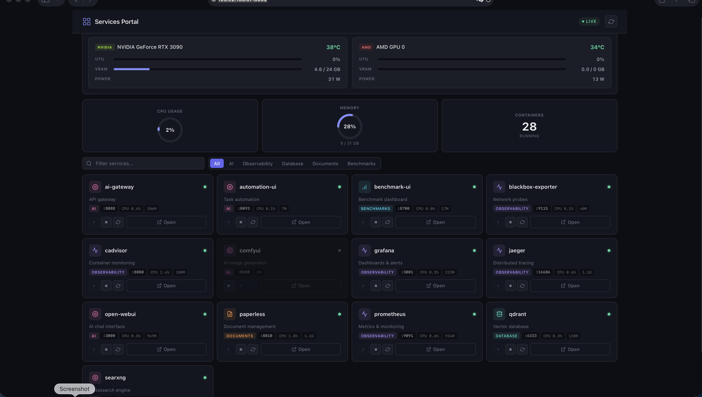

# Docker Services Portal

A single-page service discovery dashboard for the local AI workstation.  It auto-discovers
running Docker containers from the compose stack and provides one-click access to every service.

## Screenshots

| Portal UI |
|---|
|  |

## Features

- **Auto Discovery** — reads the live Docker socket; discovers all services with exposed ports
- **Service Grid** — card-per-service layout with status badge, category, description, port link
- **Status Indicators** — green/red badge per container (running/stopped)
- **Search & Filter** — filter by name or category chip (AI, Observability, Database, …)
- **Static Fallback** — predefined service list renders immediately before the Docker API responds
- **Responsive** — works on desktop and mobile
- **Live Polling** — refreshes container state periodically

## Project Structure

```
portal/
├── Dockerfile              # nginx:alpine + Python FastAPI backend (port 80)
├── api_server.py           # FastAPI backend: reads Docker socket, returns JSON
├── nginx.conf              # Reverse-proxy /api/* → FastAPI backend (port 9000)
├── index.html              # Single-page dashboard
├── js/
│   ├── utils.js            # SERVICE_CATEGORIES, SERVICE_DESCRIPTIONS, MAIN_SERVICES map
│   └── main.js             # Grid rendering, Docker API polling, search/filter
└── css/
    └── styles.css          # Dark theme styles
```

## Registered Services

Services are declared in `js/utils.js`.  To register a new service add it to all three maps:

```javascript
// MAIN_SERVICES: compose-service-name → display port
'my-service': '8099',

// SERVICE_CATEGORIES: normalised name → category key
my_service: 'ai',

// SERVICE_DESCRIPTIONS: normalised name → short description
my_service: 'What it does',
```

The `staticServices` array in `js/main.js` provides the fallback list shown while the Docker
API is loading.

### Currently Registered Services

| Service | Port | Category |
|:--------|:-----|:---------|
| prometheus | 9091 | Observability |
| grafana | 3001 | Observability |
| jaeger | 16686 | Observability |
| cadvisor | 8080 | Observability |
| blackbox-exporter | 9115 | Observability |
| qdrant | 6333 | Database |
| searxng | 8081 | AI |
| comfyui | 8188 | AI |
| open-webui | 3000 | AI |
| ai-gateway | 8088 | AI |
| benchmark-ui | 8700 | Benchmarks |
| **automation-ui** | **8093** | **AI** |
| paperless | 8010 | Documents |

## Quick Start

The portal is managed from the infrastructure compose stack:

```bash
cd ~/infrastructure-public
docker compose up -d portal
```

The portal will be available at http://localhost:3002.

To rebuild after a source change:

```bash
docker compose build portal
docker compose up -d portal
```

## API Endpoints (backend)

| Method | Path | Description |
|:-------|:-----|:------------|
| GET | `/api/docker/services` | List all services with port and status |
| GET | `/api/docker/status` | Container run/stop counts |
| GET | `/health` | Health check (nginx) |

## Changelog

### v2 (current)

- **Removed:** Automations embedded tab (automations.js, automations.css)
- **Added:** `automation-ui` service card (port 8093, category: AI)

The Automation Orchestrator is now a standalone service with its own UI at port 8093.
Clicking the card in Portal opens the full task management interface.
